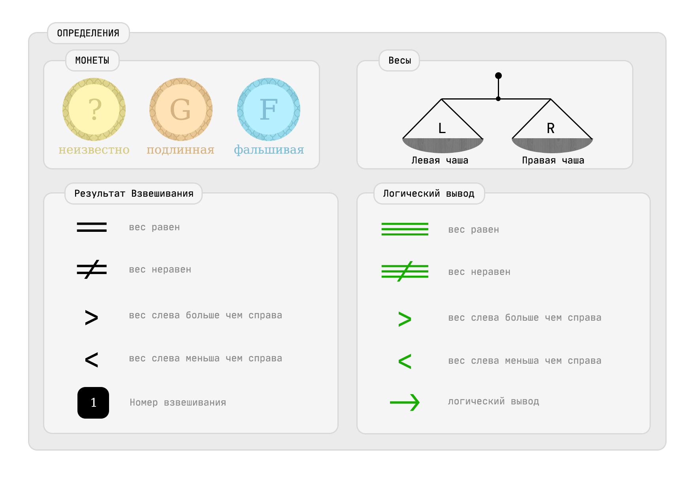

Начало Размышлений
==================

Задача на комбинаторику и сравнение.

В лоб ее решить трудно.

Буду выводить закономерности поднимаясь от меньшего числа монет к большему.

имя файла содержит число монет и как найти фальшивку среди них.

Монеты буду нумеровать и называть m1, m2, ... etc

Истинным монетам буду приписывать суффикс G - genuine

Нужно также придумать сокращенную форму записи решения, а то много текста получается

[] - Взвешивание
() - Набор монет
mX - монета
G - ИСТИННАЯ
? - под подозрением
F - ФАЛЬШИВКА
H - Heavy - тяжелее
L - Light - легче
CW - Compare Weight - Сравнение веса
-> следующее действие
@ - промежуточные выводы
$ - решение найдено
~ - Предположение

Новая волна ситематизации и упорядочивания записей
==================================================

SCH# - Schema Number - Номер схемы решения - схема решения - как распределы монеты на весах

VAR# - Номер Варианта - Возможный вариант при Одном взвешивании - показывает ветвление

WEI# - Weighing Number - Номер взвешивания в схеме

== Взвешивание Равно
!= Взвешивание НЕ Равно

=== Логический вывод Равно
!== Логический вывод НЕ Равно

