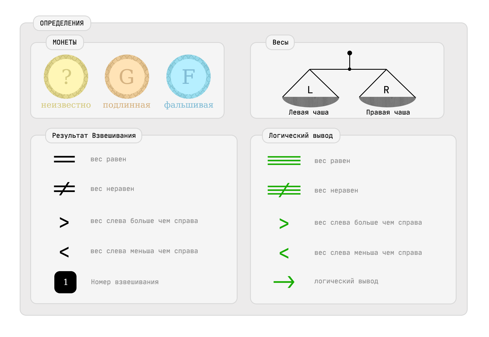

Три монеты
==========

[см Интро](00-intro.md "00-intro.md")

[Две монеты](02-coins.md "02-coins.md")

Если разделить пополам - остается одна монетка

известно, что только одна монета фальшивая
соответсвенно две ИСТИННЫЕ равны друг другу, и ФАЛЬШИВАЯ не равна ИСТИННЫМ.

Вариант 1
---------
```
Взвешивание 1.1
- m1 == m2 -> вывод m3-ФАЛЬШИВКА, m1G, m2G
```

Вариант 2
---------
```
Взвешивание 2.1
- m1 != m2 -> вывод m3G-ИСТИННАЯ,
для отбора из m1, m2 нужно сравнение с ИСТИННОЙ монетой m3G
```

```
Взвешивание 2.2
- m1 == m3G -> вывод m1G-ИСТИННАЯ, m2-ФАЛЬШИВКА,
знак неравенства от первого взвешивания показывает
-- m1G > m2 -> m2-ФАЛЬШИВКА легче ИСТИННОЙ монеты.
-- m1G < m2 -> m2-ФАЛЬШИВКА тяжелее ИСТИННОЙ монеты.
```

ВЫВОДЫ
======
ГРУППА из 3-х монет
МИНИМАЛЬНОЕ число взвешиваний = 1
МАКСИМАЛЬНОЕ число взвешиваний = 2

Схема взвешиваний описана.

```
SCHEMA-1 :: m1? == m2? !== m3?
SCHEMA-2 :: m1? != m2? -> m3G
```

МОЯ КЛИНОПИСЬ
=============

```
SCH-1
-----------------------------------------------------
SCH-1::WEI-1 [m1? == m2?] -> $ m1G, m2G, m3F $
total 1

SCH-2::WEI-1 [m1? != m2?] -> @ m1?, m2?, m3G @
SCH-2::WEI-2 [m1? == m3G] -> $ m1G, m2F, m3G $
total 2

min 1, max 2
```




[Вперед - Четыре монеты](04-coins.md "04-coins.md")